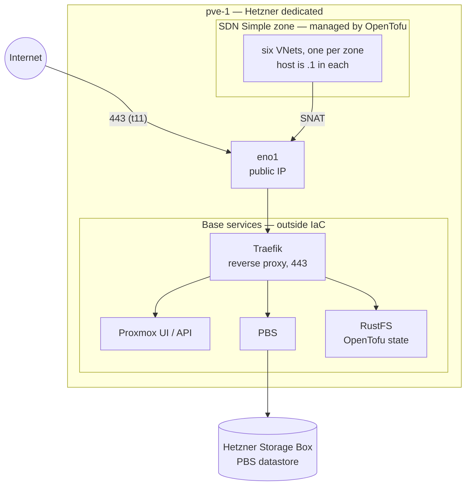
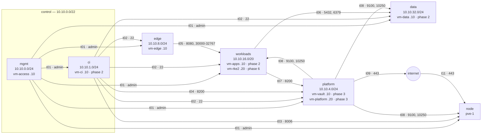
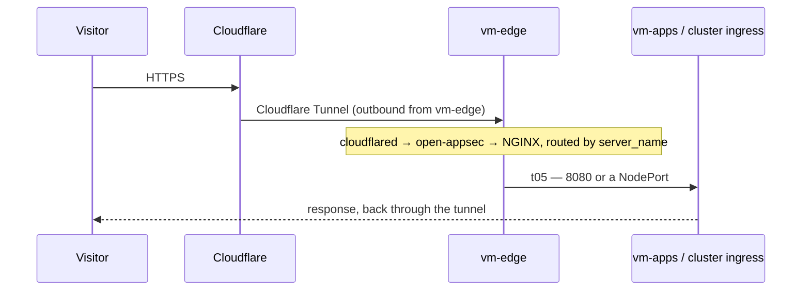
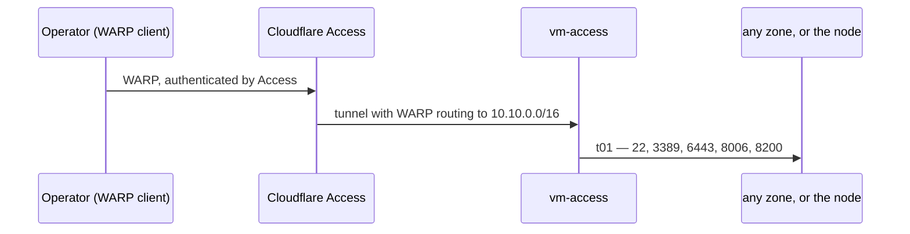
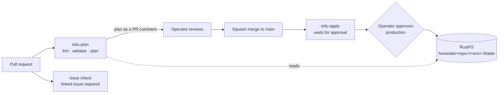
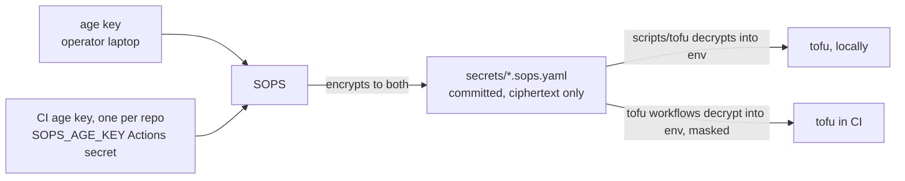

# Architecture

How the pieces of the homelab fit together. The **decisions** behind them —
and what was discarded, and why — live in
[`workspace/docs/design.md`](https://github.com/0xc0-homelab/workspace/blob/main/docs/design.md).
The **network** is normative in [`zones.md`](zones.md). This document explains;
those two decide. If they disagree with this one, they win.

Most of what follows is the target of phase 1 and later. Each section says
what exists **today** and what is **target**.

## The node

One Hetzner dedicated server, `pve-1` (`pve.0xc0.cc`): Proxmox VE 9, 12 CPU,
62 GB RAM, two NVMe disks in mdadm RAID 0.

- **Base services** — Traefik, RustFS and PBS run on the host itself. They are
  not managed by any repo in this org and nothing here may touch them. Traefik
  is only the host's reverse proxy; it is not the application ingress.
- **Disks** — RAID 0, by decision: there is no redundancy on the node. One
  NVMe failure loses it, and recovery is a reinstall plus a restore from PBS
  on the Storage Box.
- **`eno1`** keeps the public IP. Guests never attach to it: Hetzner drops
  unknown MACs on the public interface. They live on internal VNets, and reach
  the internet through SNAT on the host.

**Today:** Proxmox, Traefik, RustFS and PBS run. There are no VNets, no
guests, and the Proxmox firewall is off. **Target:** everything below.

## Zones

Each zone is a VNet in one SDN Simple zone, with a subnet whose gateway `.1` is
the host. The host routes between zones and applies the firewall; everything
not listed in the transit matrix is denied.

The arrows are the `id`s of the transit matrix in [`zones.md`](zones.md). Two
things the diagram shows by what is missing:

- **Nothing points at `mgmt`.** Nobody initiates towards the management zone.
- **Nothing leaves `data`** (`t10`). It initiates no connection, and its
  subnet has no SNAT either.

The node accepts only 22 and 8006 from `control`, plus 443 from the internet
for Traefik (`t11`) until the CI runner exists.

## Web traffic

No inbound port is opened for web traffic: `cloudflared` on `vm-edge` dials out
to Cloudflare. **No admin panel is ever published this way.** From phase 6 the
WAF moves to the cluster ingress, and is never duplicated.

**Today:** not built. **Target:** phase 1 for `vm-edge`, phase 2 for `vm-apps`.

## Admin access

The operator reaches every zone and the node's internal address directly,
without a jump host, as if on the network. Private dashboards — Grafana, Vault
UI, Proxmox — are reached this way, never through the edge.

The **way back in** if this breaks is the Hetzner Rescue system. Phase 1 is not
done until both paths have been tested, and the node's firewall goes to DROP
only after that — before, `10.10.0.0/22` is empty and the DROP would lock the
operator out.

**Today:** the operator reaches the node over its public IP, and the Proxmox
UI through Traefik. **Target:** WARP through `vm-access`, phase 1.

## Changes, CI and state

- Every change is a PR linked to an issue on the
  [project board](https://github.com/orgs/0xc0-homelab/projects/1); the
  `issue` check fails without one.
- Plans and applies use the reusable workflows in
  [`0xc0-homelab/.github`](https://github.com/0xc0-homelab/.github). Applies
  wait for the operator's approval in the `production` environment: automation
  plans, a human applies.
- Every OpenTofu root has its own state key in RustFS, locked with a lockfile.
  Plans and applies wait for the lock instead of failing.

**Today:** CI runs on GitHub-hosted runners, so RustFS is reachable from the
internet — temporarily. **Target:** from phase 2, a self-hosted runner on
`vm-ci` inside the network, and RustFS closed again
([`.github#13`](https://github.com/0xc0-homelab/.github/issues/13)).

## Secrets

- Secrets are committed **encrypted**, to the operator's key and to the repo's
  own CI key. The repos are public, so the ciphertext is too — standard SOPS
  practice; a leaked key means rotating the secrets it protects. Each repo's CI
  key decrypts only that repo's files, and is the only Actions secret there.
- CI masks every decrypted value before using it.
- `scripts/tofu` decrypts into the environment for one command; plaintext
  never reaches disk. Saved plan files are never kept, because they contain
  the variables.
- From phase 2, the CI keys live on `vm-ci` and the Actions secrets go away. From phase 3, secrets move
  progressively to Vault over OIDC.

## Backups

PBS on the host backs up to a datastore on the Hetzner Storage Box. Phase 2
adds an off-site copy to B2 and a restore that is **timed and written down** —
until that restore has been done, the backups are not considered tested. With
RAID 0 on the node, that restore is the recovery plan.

## Where each thing lives

| Concern | Source of truth |
|---|---|
| Decisions, phases, discarded options | [`workspace/docs/design.md`](https://github.com/0xc0-homelab/workspace/blob/main/docs/design.md) |
| Zones, addresses, transit, invariants | [`docs/zones.md`](zones.md) |
| How it fits together | this document |
| State of the work | [project board](https://github.com/orgs/0xc0-homelab/projects/1) |
| Current phase | `CLAUDE.md` of each repo; `/phase` keeps them in sync |
| The org and its repos | [`0xc0-homelab/.github`](https://github.com/0xc0-homelab/.github) |
