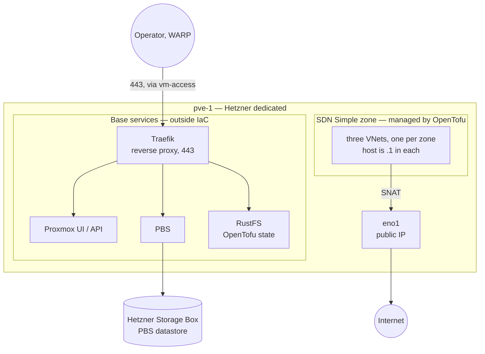
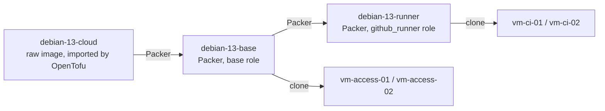
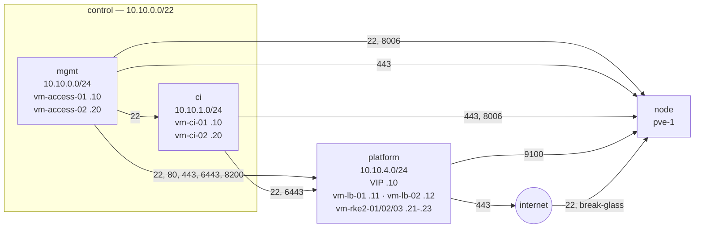
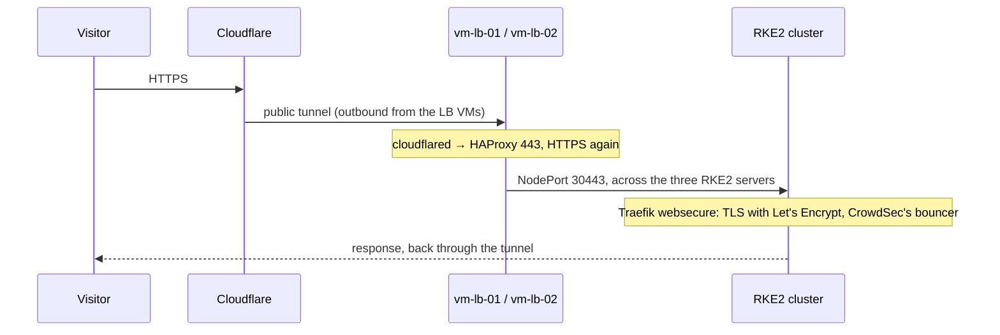
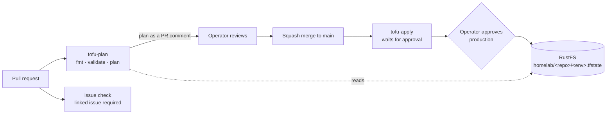
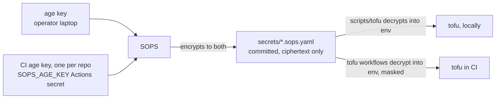

# Architecture

How the pieces of the homelab fit together. The **decisions** behind them —
and what was discarded, and why — live in
[`workspace/docs/design.md`](https://github.com/0xc0-homelab/workspace/blob/main/docs/design.md).
The **network** is decided by the code, in
[`terraform.tfvars`](../environments/prod/terraform.tfvars), and explained in
[`zones.md`](zones.md). This document explains how it fits together; if it
disagrees with the code or with `design.md`, they win.

Phase 1 is complete. This document covers every phase; each section says what
exists **today** and what is **target** for a later one.

## The node

One Hetzner dedicated server, `pve-1` (`pve.0xc0.cc`): Proxmox VE 9, 12 CPU,
62 GB RAM, two NVMe disks in mdadm RAID 0.


```mermaid
flowchart TB
  internet(("Internet"))

  subgraph host["pve-1 — Hetzner dedicated"]
    eno1["eno1<br/>public IP"]

    subgraph base["Base services — outside IaC"]
      traefik["Traefik<br/>reverse proxy, 443"]
      pveui["Proxmox UI / API"]
      pbs["PBS"]
      rustfs["RustFS<br/>OpenTofu state"]
    end

    subgraph sdn["SDN Simple zone — managed by OpenTofu"]
      zones["three VNets, one per zone<br/>host is .1 in each"]
    end
  end

  sbox[("Hetzner Storage Box<br/>PBS datastore")]

  operator(("Operator, WARP")) -- "443, via vm-access" --> traefik
  traefik --> pveui
  traefik --> pbs
  traefik --> rustfs
  pbs --> sbox
  zones -- "SNAT" --> eno1 --> internet
```

- **Base services** — Traefik, RustFS and PBS run on the host itself. They are
  not managed by any repo in this org and nothing here may touch them. Traefik
  is only the host's reverse proxy; it is not the application ingress.
- **Disks** — RAID 0, by decision: there is no redundancy on the node. One
  NVMe failure loses it, and recovery is a reinstall plus a restore from PBS
  on the Storage Box.
- **`eno1`** keeps the public IP. Guests never attach to it: Hetzner drops
  unknown MACs on the public interface. They live on internal VNets, and reach
  the internet through SNAT on the host.
- **Docker** runs Traefik and RustFS, and is configured by hand, outside IaC,
  with one setting the zone firewall depends on. `/etc/docker/daemon.json`:

  ```json
  {"ip-forward-no-drop": true}
  ```

  Without it Docker sets the `FORWARD` policy to DROP. The Proxmox firewall
  explicitly accepts only traffic *into* a VM. It leaves traffic *out of* a
  VM, and the hop across a zone bridge, to that policy, so every VM loses its
  egress and its peers (tested in
  [`#2`](https://github.com/0xc0-homelab/infrastructure/issues/2)). On a
  reinstalled node, write that file, restart Docker and run
  `iptables -P FORWARD ACCEPT` **before** the first apply.
- **Hetzner firewall**, in Robot, also by hand. It is stateless: a reply gets
  in only if an incoming rule matches it. TCP replies pass through the `ack`
  rule, UDP only for what is listed. Besides DNS and NTP (source ports 53 and
  123), cloudflared's QUIC needs **udp from `198.41.192.0/20`, source port
  7844, to ports 32768-65535**. Without it the tunnel falls back to HTTP/2
  ([`#37`](https://github.com/0xc0-homelab/infrastructure/issues/37)). IPv6
  is not filtered there.

**Today:** Proxmox, Traefik, RustFS and PBS run, with the three VNets, the two
`vm-access` connectors and the zone firewall on.

## Templates


```mermaid
flowchart LR
  cloud["debian-13-cloud<br/>raw image, imported by OpenTofu"]
  base["debian-13-base<br/>Packer, base role"]
  runner["debian-13-runner<br/>Packer, github_runner role"]

  cloud -- "Packer" --> base
  base -- "Packer" --> runner
  base -- "clone" --> vmaccess["vm-access-01 / vm-access-02"]
  runner -- "clone" --> vmci["vm-ci-01 / vm-ci-02"]
```

OpenTofu imports the official `debian-13-cloud` image straight from Debian, as
a raw template no VM ever clones. Packer bakes `debian-13-base` from it, with
the `base` role, and `debian-13-runner` from `debian-13-base`, with the
`github_runner` role (`packer/build-order`). Every merge to `main` that
touches `packer/` or those roles rebuilds both templates in CI, after
approval: each one deleted by name and built again. VMs are full clones and
ignore later changes to their template; moving one onto a new build is
bumping its `rebuild` counter.

## Zones

Each zone is a VNet in one SDN Simple zone, with a subnet whose gateway `.1` is
the host. The host routes between zones and applies the firewall; everything
not listed in the transit matrix is denied.


```mermaid
flowchart LR
  subgraph control["control — 10.10.0.0/22"]
    mgmt["mgmt<br/>10.10.0.0/24<br/>vm-access-01 .10<br/>vm-access-02 .20"]
    ci["ci<br/>10.10.1.0/24<br/>vm-ci-01 .10<br/>vm-ci-02 .20"]
  end
  platform["platform<br/>10.10.4.0/24<br/>VIP .10<br/>vm-lb-01 .11 · vm-lb-02 .12<br/>vm-rke2-01/02/03 .21-.23"]
  node["node<br/>pve-1"]
  internet(("internet"))

  mgmt -- "22" --> ci
  mgmt -- "22, 80, 443, 6443, 8200" --> platform
  mgmt -- "22, 8006" --> node
  mgmt -- "443" --> node
  ci -- "22, 6443" --> platform
  ci -- "443, 8006" --> node
  platform -- "9100" --> node
  platform -- "443" --> internet
  internet -- "22, break-glass" --> node
```

The arrows are the entries of the transit matrix (`transit` in
`terraform.tfvars`), with their ports. Two things the diagram shows by what is
missing:

- **Nothing points at `mgmt` from another zone.** Only SSH between the two
  `vm-access` connectors stays inside it.
- **`platform`'s internal traffic never leaves it.** The cluster's own ports —
  etcd, the Kubernetes API, Canal's health check and its VXLAN overlay
  (UDP 8472), the supervisor port, kubelet, the NodePort range, and keepalived
  between the two LB VMs (VRRP, no ports) — stay inside the zone, so they are
  self-loops the diagram does not draw. They are still entries of the matrix,
  `platform -> platform`.

The node accepts 22, 443 and 8006 from `mgmt`, 443 and 8006 from `ci`, and the
node-metrics scrape (9100) from `platform`. From the internet it accepts only
SSH, as break-glass for when WARP is down: the Hetzner firewall keeps it
closed until the operator opens it. Traefik is reached over WARP, where
Gateway resolves its hostnames to `10.10.0.1`.

## Web traffic


```mermaid
sequenceDiagram
  participant U as Visitor
  participant CF as Cloudflare
  participant LB as vm-lb-01 / vm-lb-02
  participant K as RKE2 cluster

  U->>CF: HTTPS
  CF->>LB: public tunnel (outbound from the LB VMs)
  Note over LB: cloudflared → HAProxy 443, HTTPS again
  LB->>K: NodePort 30443, across the three RKE2 servers
  Note over K: Traefik websecure: TLS with Let's Encrypt, CrowdSec's bouncer
  K-->>U: response, back through the tunnel
```

No inbound port is opened for web traffic: `cloudflared` on the LB VMs dials
out to Cloudflare. From there to Traefik the traffic is HTTPS again, checked
against a Let's Encrypt wildcard issued by cert-manager (DNS-01 through
Cloudflare), with the request's host as SNI. The tunnel serves every name of
each domain in `public_domains`; a name is public only once external-dns gives
it a record, which it does only for the routes marked public.

**No admin panel is ever published this way**: the portals,
Vault and the Kubernetes API are reached only over WARP (operator decision,
2026-09-29; publishing a portal behind Cloudflare Access is deferred).

**Today:** not built. **Target:** phase 2, the LB pair and the RKE2 cluster's
ingress.

## Admin access

```mermaid
sequenceDiagram
  participant O as Operator (WARP client)
  participant CF as Cloudflare Access
  participant V as vm-access
  participant Z as any zone, or the node

  O->>CF: WARP, authenticated by Access
  CF->>V: tunnel with WARP routing to 10.10.0.0/16
  V->>Z: whatever mgmt's matrix entries allow towards it — SSH everywhere, the portals (HTTPS on the VIP's 443; 80 only redirects), the Kubernetes API and Vault towards platform, the Proxmox API towards the node
```

The operator reaches every zone and the node's internal address directly,
without a jump host, as if on the network. Private dashboards — Grafana, Vault
UI, Proxmox — are reached this way, never through the public tunnel.

The **way back in** if this breaks is the Hetzner Rescue system.

**Today:** WARP through the two `vm-access` connectors. The node's own
firewall is on DROP: SSH, the Proxmox UI on 8006 and Traefik on 443 answer
on `10.10.0.1`. The public IP accepts only break-glass SSH, closed at the
Hetzner firewall until it is needed.

## Changes, CI and state


```mermaid
flowchart LR
  pr["Pull request"] --> plan["tofu-plan<br/>fmt · validate · plan"]
  pr --> issue["issue check<br/>linked issue required"]
  plan -- "plan as a PR comment" --> review["Operator reviews"]
  review --> merge["Squash merge to main"]
  merge --> apply["tofu-apply<br/>waits for approval"]
  apply --> approve{"Operator approves<br/>production"}
  approve --> state[("RustFS<br/>homelab/&lt;repo&gt;/&lt;env&gt;.tfstate")]
  plan -. "reads" .-> state
```

- Every change is a PR linked to an issue on the
  [project board](https://github.com/orgs/0xc0-homelab/projects/1); the
  `issue` check fails without one.
- Plans and applies use the reusable workflows in
  [`0xc0-homelab/.github`](https://github.com/0xc0-homelab/.github). Applies
  wait for the operator's approval in the `production` environment: automation
  plans, a human applies.
- Every OpenTofu root has its own state key in RustFS, locked with a lockfile.
  Plans and applies wait for the lock instead of failing.

**Today:** plans, applies, Packer builds and every playbook run on ephemeral
runners, two on each CI VM (`vm-ci-01`, `vm-ci-02`), inside the network. The
runner group admits only the reusable workflows from `0xc0-homelab/.github`,
as they are on `main`, and fork PRs go to GitHub's runners, where they get no secrets.
RustFS and the rest of Traefik are not reachable from the internet.

## Secrets


```mermaid
flowchart LR
  key["age key<br/>operator laptop"] --> sops["SOPS"]
  cikey["CI age key, one per repo<br/>SOPS_AGE_KEY Actions secret"] --> sops
  sops -- "encrypts to both" --> file["secrets/*.sops.yaml<br/>committed, ciphertext only"]
  file -- "scripts/tofu decrypts into env" --> tofu["tofu, locally"]
  file -- "tofu workflows decrypt into env, masked" --> ci["tofu in CI"]
```

- Secrets are committed **encrypted**, to the operator's key and to the repo's
  own CI key. The repos are public, so the ciphertext is too — standard SOPS
  practice; a leaked key means rotating the secrets it protects. Each repo's CI
  key decrypts only that repo's files, and is the only Actions secret there.
- CI masks every decrypted value before using it.
- `scripts/tofu` decrypts into the environment for one command; plaintext
  never reaches disk. Saved plan files are never kept, because they contain
  the variables.
- From phase 2, the CI keys live on the CI VMs and the Actions secrets go away. From phase 3, secrets move
  progressively to Vault over OIDC.

## Backups

PBS on the host backs up to a datastore on the Hetzner Storage Box. Phase 2
adds an off-site copy to B2 and a restore that is **timed and written down** —
until that restore has been done, the backups are not considered tested. With
RAID 0 on the node, that restore is the recovery plan.

## Where each thing lives

| Concern | Source of truth |
|---|---|
| Decisions, phases, discarded options | [`workspace/docs/design.md`](https://github.com/0xc0-homelab/workspace/blob/main/docs/design.md) |
| Zones, VMs, transit matrix | [`environments/prod/terraform.tfvars`](../environments/prod/terraform.tfvars) |
| Reserved ranges, addressing plan, invariants | [`docs/zones.md`](zones.md) |
| How it fits together | this document |
| State of the work | [project board](https://github.com/orgs/0xc0-homelab/projects/1) |
| Current phase | `CLAUDE.md` of each repo; `/phase` keeps them in sync |
| The org and its repos | [`0xc0-homelab/.github`](https://github.com/0xc0-homelab/.github) |
